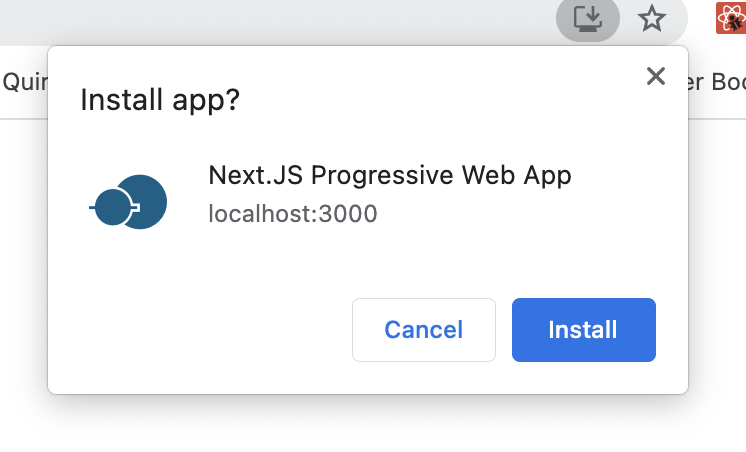

# sketch-web-pwa-manifest-icons-exporter

The anotherplanet.io Logo is not open source.
It is just an example.

WIP

Please do not use it, but replace it by yours into the icon-color symbol.

All other icon will be replaced by the icon-color symbol.

Sketch Icons Exporter for Instalable WEB PWA app.

to be continued...

…

[Workbox](https://developers.google.com/web/tools/workbox/)
